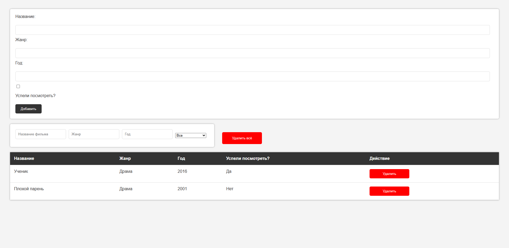

# Movie Library App 🎬

A web application for managing your personal movie collection with CRUD operations, filtering, and form validation. Demonstrates working with REST API, asynchronous requests, and DOM manipulation.

## 🚀 Live Demo  
**[View the live website here](https://kseniiasad.github.io/Movie-library-app/)**

## 📸 Preview

## ✨ Features

- **Add Movies**: Form with validation for adding new movies
- **Smart Filtering**: Real-time filtering by title, genre, release year, and watched status
- **Delete Operations**: Remove individual movies or clear entire collection
- **Form Validation**: Comprehensive client-side validation
- **Real-time Updates**: Table updates immediately after any operation

## 🛠 Technologies Used

- **JavaScript (ES6+)**: Core application logic
- **Fetch API**: HTTP requests handling
- **REST API**: Server communication
- **HTML5 & CSS3**: Structure and styling
- **Async/Await**: Asynchronous programming

## 📁 Project Structure
Movie-library-app/
├── index.html
├── script.js
├── styles.css
├── README.md
├── preview.png

## 📬 Contact  
[My GitHub Profile](https://github.com/KseniiaSad)
